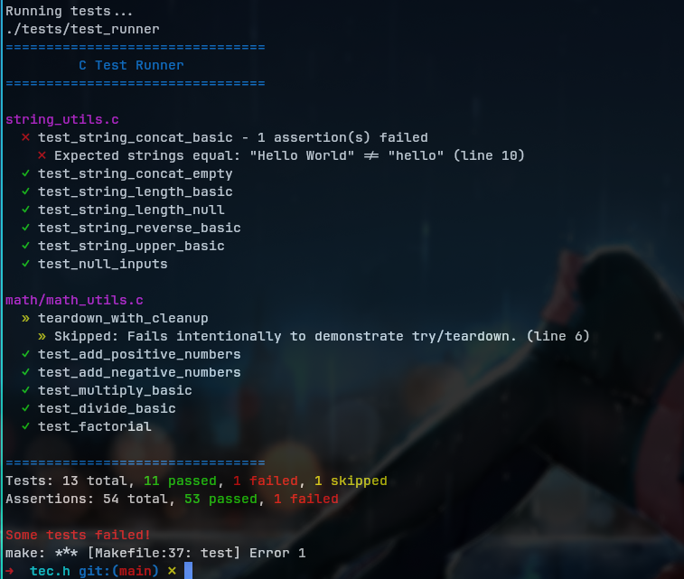

# tec.h

A tiny, **header-only** testing library for C and C++. Created because unit testing
shouldn't require complex setup or build system gymnastics, **tec.h** gets out of
your way so you can just write tests. Zero-setup unit testing is just one `#include` away.

## Why TEC?
- **Zero setup**: drop in a single header, start writing tests.
- **No build system magic**: works with raw `gcc` or `clang`.
- **Cross-language**: the same tests run in both C and C++.
- **Automatic discovery**: no need to list or register test cases manually.

> [!IMPORTANT]
> TEC is currently in the early stages of development, and while it is somewhat
> functional, it may still have some limitations and is subject to change.

## Table of Contents
- [In Action](#in-action)
- [Why TEC](#why-tec)
- [Quick Start](#quick-start)
- [Features](#features)
- [Test Suites](#test-suites)
- [Assertion API](#assertion-api)
- [Advanced Usage](#advanced-usage)
  - [Filtering Tests](#filtering-tests)
  - [Test Fixtures (Setup & Teardown)](#test-fixtures-setup--teardown)
  - [Test Control](#test-control)
    - [Skipping Tests](#skipping-tests)
    - [Expected Failures](#expected-failures)
  - [Floating-Point Comparisons](#floating-point-comparisons)
  - [Resource Cleanup](#resource-cleanup)
    - [C: TEC_TRY_BLOCK](#c-the-tec_try_block)
    - [C++: try-catch](#c-trycatch)
- [C++ Integration](#c-integration)
  - [Exception Handling](#exception-handling)
  - [Testing for Exceptions](#testing-for-exceptions)
  - [Resource Management (RAII)](#resource-management-raii)
- [Example Project & Makefile](#example-project--makefile)


***

## In Action


## Quick Start

1.  Grab `tec.h` and drop it into your project.
2.  Create a test file (e.g., `my_test.c`).
3.  Write some tests.

```c
// my_test.c
#define TEC_IMPLEMENTATION
#include "tec.h"          // The testing library

TEC(arithmetic, test_addition) {
    TEC_ASSERT_EQ(2 + 2, 4);
    TEC_ASSERT_NE(2 + 2, 5);
}

TEC(string_test, test_strings) {
    const char* str = "hello";
    TEC_ASSERT_STR_EQ(str, "hello");
}

TEC_MAIN()
```
> See the full list of assertions in the **[Assertion API](#assertion-api)**.

4. Compile and run it:

```bash
$ gcc my_test.c -o test_runner && ./test_runner

================================
         C Test Runner
================================

SUITE: arithmetic (my_test.c)
  ✓ test_addition

SUITE: string_test (my_test.c)
  ✓ test_strings

================================
Tests:      2 passed, 0 failed (2 total)
Assertions: 3 passed, 0 failed (3 total)

All tests passed!
```
That's it. There is no step 5.

> [!CAUTION]
> **MSVC is not supported.**
>
> TEC relies heavily on GCC extensions like `__auto_type` and `__attribute__((constructor))`.
> As a result, TEC is highly compatible on GCC and Clang and will not compile or work with MSVC.
>
> Windows users should build using **MinGW-w64** or **Clang** rather than MSVC.

---

## Features

- **Header-Only**: Just `#include "tec.h"`. No libraries to build or link.
- **No Dependencies**: Written in standard C/C++ with common GCC/Clang extensions.
- **Rich Assertion Set**: Comprehensive assertions including floating-point comparisons, string equality, and null checks.
- **Automatic Test Registration**: The `TEC()` macro registers tests. `TEC_MAIN()` runs them.
- **Dynamic Test Capacity**: The test registry grows as needed, so you don't have to worry about a predefined test limit.
- **C & C++ Compatibility**: Works seamlessly in both C and C++ projects, automatically adapting its failure mechanism (`longjmp` vs. `exceptions`).
- **Expected Failures**: Mark tests that should fail with `TEC_XFAIL()` for test-driven development.
- **Colored Output**: Clear, colored terminal output for better readability.
- **Test Filtering**: Run specific tests using command-line filters.

---

## Test Suites

Tests are defined and grouped into suites using the `TEC(suite_name, test_name)` macro.

- `suite_name`: The name of the test group. All tests with the same suite_name will be grouped together in the output.
- `test_name`: The unique name of the individual test case.

```c
// All these tests will appear under the "math" suite in the output.
TEC(math, test_addition) { /* ... */ }
TEC(math, test_multiplication) { /* ... */ }

// This test will start a new "memory" suite.
TEC(memory, test_allocation) { /* ... */ }
```

---

## Assertion API

The library provides a straightforward set of assertions. On failure, it prints the file, line number, and the failed expression.

| Macro                           | Description                                       | Example Usage                                    |
|---------------------------------|---------------------------------------------------|--------------------------------------------------|
| `TEC_ASSERT(expression)`        | Asserts that `expression` is true.                | `TEC_ASSERT(count > 0);`                         |
| **Booleans**                    |                                                   |                                                  |
| `TEC_ASSERT_TRUE(expression)`   | Asserts that `expression` is true.                | `TEC_ASSERT_TRUE(is_valid);`                     |
| `TEC_ASSERT_FALSE(expression)`  | Asserts that `expression` is false.               | `TEC_ASSERT_FALSE(has_error);`                   |
| **Equality & Inequality**       |                                                   |                                                  |
| `TEC_ASSERT_EQ(a, b)`           | Asserts that `a == b`.                            | `TEC_ASSERT_EQ(result, 42);`                     |
| `TEC_ASSERT_NE(a, b)`           | Asserts that `a != b`.                            | `TEC_ASSERT_NE(id1, id2);`                       |
| **Comparison Operators**        |                                                   |                                                  |
| `TEC_ASSERT_GT(a, b)`           | Asserts that `a > b`.                             | `TEC_ASSERT_GT(score, min_score);`               |
| `TEC_ASSERT_GE(a, b)`           | Asserts that `a >= b`.                            | `TEC_ASSERT_GE(level, threshold);`               |
| `TEC_ASSERT_LT(a, b)`           | Asserts that `a < b`.                             | `TEC_ASSERT_LT(temp, limit);`                    |
| `TEC_ASSERT_LE(a, b)`           | Asserts that `a <= b`.                            | `TEC_ASSERT_LE(retries, max_retries);`           |
| **Floating-Point**              |                                                   |                                                  |
| `TEC_ASSERT_FLOAT_EQ(a, b)`     | Asserts floating-point equality with tolerance.   | `TEC_ASSERT_FLOAT_EQ(result, 3.14159);`          |
| `TEC_ASSERT_NEAR(a, b, tol)`    | Asserts values are within tolerance.              | `TEC_ASSERT_NEAR(actual, 1.0, 0.001);`           |
| **String & Pointer**            |                                                   |                                                  |
| `TEC_ASSERT_STR_EQ(a, b)`       | Asserts that two strings are equal.               | `TEC_ASSERT_STR_EQ(msg, "OK");`                  |
| `TEC_ASSERT_NULL(ptr)`          | Asserts that pointer is `NULL`.                   | `TEC_ASSERT_NULL(response);`                     |
| `TEC_ASSERT_NOT_NULL(ptr)`      | Asserts that pointer is not `NULL`.               | `TEC_ASSERT_NOT_NULL(data);`                     |
| **Test Control**                |                                                   |                                                  |
| `TEC_SKIP(reason)`              | Skips the current test and reports reason.        | `TEC_SKIP("Not implemented yet.");`              |
| **C++ Exception Testing**       |                                                   |                                                  |
| `TEC_ASSERT_THROWS(stmt, type)` | Asserts `stmt` throws exception `type`. (C++ only)| `TEC_ASSERT_THROWS(func(), std::runtime_error);` |


---

## Advanced Usage

### Filtering Tests
#### Filter by suite/test name.
You can selectively run tests by using `-f` or `--filter` followed by a substring pattern.
The filter is matched against the full test name in the format: `suite_name.test_name`

```bash
./test_runner -f math           # runs tests like math.add, math.subtract, etc.
./test_runner --filter alloc    # matches memory.alloc, buffer.alloc, etc.
./test_runner -f division -f io # runs tests matching "division" OR "io"
```
#### Excluding tests (negative filters)
Prefix a filter with `!` to **exclude** tests whose name (or filename) contains the given substring.

```bash
./test_runner -f '!slow'              # run all tests except those containing "slow"
./test_runner -f math -f '!division'  # run math tests, but exclude math.division
./test_runner -f '!io' -f '!network'  # exclude all io and network tests
```
Negative filters can be freely mixed with positive filters:
- **Positive filters:** include matching tests.
- **Negative filters:** always exclude matching tests.
#### Filter by filename
Prefer filtering at the file level?
Add `--file` to make `-f/--filter` match against **filenames** instead of `suite.test` names.

```bash
./test_runner --file -f math_tests   # runs all tests in files matching "math_tests"
./test_runner --file -f '!legacy'    # exclude tests from files containing "legacy"
./test_runner --file -f io.cpp       # runs tests from files containing "io.cpp"
```
> Rules of Filtering
- Filters are **case-sensitive** and use simple **substring** matching (not regex).
- You can provide multiple filters.
- Filters starting with `!` are **exclusion filters**.
- **Exclusion filters are vetoes**: if any exclusion filter matches, the test is skipped,
  even if it also matches an inclusion filter.
- If one or more **inclusion filters** are provided, a test must match at least one to run.
- If only **exclusion filters** are provided, all tests run except those excluded.
- If no filters are given, **all registered tests** are executed.

> [!NOTE]
> When using `--file`, filters (including exclusions) apply only to filenames.
> Individual tests inside a matched file are not filtered.
>
> I might add support for combined file and test filtering later(not a promise :)

### Fail-Fast Mode
You can stop test execution immediately after the first failure or unexpected
success (XPASS) using `--fail-fast`.
```bash
./test_runner --fail-fast
```
This is useful when you want fast feedback while iterating on a failing test.

### Output & Color Control
By default, TEC automatically enables colored output when running in a TTY,
and falls back to plain output when stdout is redirected.

> [!NOTE]
> On Windows, TEC defaults to ASCII output due to limited UTF-8 console support.

You can override this behavior using CLI flags:
```bash
./test_runner --no-color   # disable colored output
./test_runner --ascii      # force ASCII symbols instead of Unicode
```

TEC also respects standard environment variables:
- `NO_COLOR` — disable colored output
- `FORCE_COLOR` — force color output even when stdout is not a TTY

> [!IMPORTANT]
> Precedence order (highest to lowest):
> 1. CLI flags (--no-color, --ascii)
> 2. Environment variables (NO_COLOR, FORCE_COLOR)
> 3. Automatic detection (TTY, terminal capabilities)
>
> When `NO_COLOR` is set, TEC disables colored output and falls back to ASCII
> symbols by default.


### Test Fixtures (Setup & Teardown)
Fixtures are functions that set up a common state or context before your tests
run and clean up afterwards. This is useful for allocating resources, opening
files, or initializing data structures, preventing code duplication across
tests.

> If a suite setup fails, all tests in that suite are skipped.
> If a test setup fails, only that test is skipped.

- `TEC_SETUP(suite_name)`: Runs **once**, before the first test in the suite.
- `TEC_TEARDOWN(suite_name)`: Runs **once**, after the last test in the suite.
- `TEC_TEST_SETUP(suite_name)`: Runs before **each individual** test in the suite.
- `TEC_TEST_TEARDOWN(suite_name)`: Runs after **each individual** test in the suite.

```c
// A shared buffer for our tests
static char* shared_buffer = NULL;

// Runs once before all "buffer_tests"
TEC_SETUP(buffer_tests) {
    printf("  (Setting up suite...)\n");
    shared_buffer = (char*)malloc(100);
}

// Runs once after all "buffer_tests"
TEC_TEARDOWN(buffer_tests) {
    printf("  (Tearing down suite...)\n");
    free(shared_buffer);
    shared_buffer = NULL;
}

// Runs before EACH test in this suite
TEC_TEST_SETUP(buffer_tests) {
    strcpy(shared_buffer, "initial_state");
}

// --- Tests ---
TEC(buffer_tests, test_one) {
    TEC_ASSERT_STR_EQ(shared_buffer, "initial_state");
    strcpy(shared_buffer, "modified_by_one");
}

TEC(buffer_tests, test_two) {
    // This test gets a fresh state because TEC_TEST_SETUP ran again
    TEC_ASSERT_STR_EQ(shared_buffer, "initial_state");
}
```

### Test Control

#### Skipping Tests
You can skip a test by placing `TEC_SKIP("reason")` at the beginning of its body.
This is useful for temporarily disabling tests for features that are not yet implemented.

```c
TEC(feature_x, test_new_functionality) {
    TEC_SKIP("This feature isn't ready for testing yet.");
    // This code will not be executed.
    TEC_ASSERT(false);
}
```

#### Expected Failures
For features with known bugs, you can use `TEC_XFAIL` to define a test that is
expected to fail. The test suite will **only pass** if this test **actually fails**.
If an XFAIL test **unexpectedly succeeds**, it will be reported as a **failure**,
alerting you that the bug may have been fixed.

```c
TEC_XFAIL(incomplete, test_not_implemented_yet) {
    // This test is expected to fail
    TEC_ASSERT_EQ(unimplemented_function(), 42);
}
```

### Floating-Point Comparisons
Comparing floating-point numbers for exact equality is often a mistake.
- `TEC_ASSERT_FLOAT_EQ(a, b)` is a convenient macro that compares a and b using
a small, default tolerance `(DBL_EPSILON * 4.0)`. It's useful for most common cases.
- `TEC_ASSERT_NEAR(a, b, tolerance)` gives you explicit control over the maximum
allowed difference. Use this when you need a specific tolerance for your calculations.
```c
TEC(math, test_floating_point) {
    double result = 0.1 + 0.2;

    // Use FLOAT_EQ for automatic tolerance
    TEC_ASSERT_FLOAT_EQ(result, 0.3);

    // Or specify your own tolerance
    TEC_ASSERT_NEAR(result, 0.3, 0.0001);
}
```
> See the full list of assertions in the **[Assertion API](#assertion-api)**.

### Resource Cleanup
When an assertion fails, `tec.h` immediately stops the test. In C, this is done
with `longjmp`, and in C++, an `exception` is thrown. This can cause resource leaks
if the test allocated memory or opened files.

> See examples for **[C: TEC_TRY_BLOCK](#c-the-tec_try_block)** and **[C++: try-catch](#c-trycatch)**.

#### C: The `TEC_TRY_BLOCK`
To ensure cleanup code runs, you can wrap your assertions in a `TEC_TRY_BLOCK`.

If an assertion inside the block fails, execution will "jump" to the end of the
block, allowing the code that follows it to run. The test will still be marked as a failure.

```c
TEC(cleanup, test_with_cleanup) {
    char* buffer = malloc(100);
    TEC_ASSERT_NOT_NULL(buffer); // A failure here would skip the free() call.

    TEC_TRY_BLOCK {
        // Assertions inside this block are safe.
        strcpy(buffer, "hello");
        TEC_ASSERT_EQ(buffer[0], 'h');
        TEC_ASSERT_EQ(1, 0); // This will fail...
        TEC_ASSERT(false);   // ...and this line will never be reached.
    }

    // ...but the jump lands here, so cleanup can proceed.
    printf("Cleaning up resources...\n");
    free(buffer);
}
```

#### C++: `try...catch`
In C++, assertion failures throw a [`tec_assertion_failure`](#exception-handling)
exception instead of using `longjmp`. You can wrap your test logic in a standard
`try...catch` block to ensure cleanup code runs before rethrowing the exception.

See **[C++ Integration → Exception Handling](#exception-handling)** for a full example.

---

## C++ Integration
`tec.h` is fully compatible with C++. When compiled with a C++ compiler, it
automatically switches from `setjmp/longjmp` to throwing `exceptions` on assertion
failures, enabling modern C++ practices.

### Exception Handling
An assertion failure throws a `tec_assertion_failure` exception. You can use
standard `try...catch` blocks for resource cleanup, just as you would in any other
C++ code.

```cpp
TEC(cpp_style, manual_cleanup) {
    // A raw pointer that must be manually deleted.
    int* my_int = new int(100);

    try {
        TEC_ASSERT_EQ(*my_int, 99); // This fails and throws.
    } catch (...) {
        // The catch block ensures our resource is freed.
        std::cout << "  Cleaning up after failure..." << std::endl;
        delete my_int;
        // Re-throw the exception so the test is correctly marked as failed.
        throw;
    }

    // This code is unreachable if the assertion above fails.
    delete my_int;
}
```

### Testing for Exceptions
You can verify that a piece of code throws the correct type of exception using
`TEC_ASSERT_THROWS`. This is only available in C++.

The test will pass if the statement throws an exception of the exact type
specified. It will fail if it throws a different type of exception, or no
exception at all.

```cpp
#include <stdexcept>

void function_that_throws() {
    throw std::runtime_error("Something went wrong!");
}

TEC(exceptions, test_throws) {
    // This assertion will pass.
    TEC_ASSERT_THROWS(function_that_throws(), std::runtime_error);

    // This assertion will fail, because the wrong type is thrown.
    TEC_ASSERT_THROWS(function_that_throws(), std::invalid_argument);
}
```

### Resource Management (RAII)
A better approach in C++ is to use RAII (Resource Acquisition Is Initialization)
with smart pointers and standard containers. This eliminates the need for manual
cleanup, as resources are automatically released when they go out of scope, even
when an exception is thrown.

```cpp
#include <vector>
#include <memory>

TEC(cpp_style, raii_with_smart_pointers) {
    // The unique_ptr will automatically delete the array on scope exit.
    std::unique_ptr<int[]> my_array(new int[100]);
    TEC_ASSERT(my_array != nullptr);

    // The vector's destructor will handle its own memory.
    std::vector<int> my_vector = {1, 2, 3};
    TEC_ASSERT_EQ(my_vector.size(), (size_t)4); // Fails and throws.

    // No manual cleanup needed. The test fails, and all memory is freed correctly.
}
```

---

## Example Project & Makefile

For projects with multiple source files, a Makefile keeps things tidy. The included Makefile is designed to be "hands-off."

### Project Structure
```bash
my_project/
├── include/
│   └── calculator.h
├── src/
│   ├── calculator.c
│   └── main.c
├── tests/
│   ├── test_calculator.c
│   └── test_runner.c
├── Makefile
└── tec.h
```

> [!TIP]
> The build system automatically excludes your application's main()
> function when compiling tests, so you can have both `src/main.c` and
> `tests/test_runner.c` without conflicts.

### Test Runner Setup
```c
// tests/test_runner.c
#define TEC_IMPLEMENTATION
#include "../tec.h"
TEC_MAIN()
```

### Individual Test File

```c
// tests/test_calculator.c
#include "calculator.h"
#include "../tec.h"

TEC(calculator, test_add) {
    TEC_ASSERT_EQ(add(2, 3), 5);
    TEC_ASSERT_EQ(add(-1, 1), 0);
}

TEC(calculator, test_multiply) {
    TEC_ASSERT_EQ(multiply(3, 4), 12);
    TEC_ASSERT_EQ(multiply(0, 100), 0);
}
```

### Automated Testing

The provided Makefile automatically:
- Finds your `test` files
- Compiles the test binary
- Runs the tests

**Usage:**

```bash
$ make test
gcc -Wall -Wextra -pedantic -Iinclude -c tests/calculator.c -o build/tests/calculator.o
gcc -Wall -Wextra -pedantic -Iinclude -c tests/test_runner.c -o build/tests/test_runner.o
gcc -Wall -Wextra -pedantic -Iinclude -c src/calculator.c -o build/src/calculator.o
gcc -Wall -Wextra -pedantic -Iinclude -o test_runner build/tests/calculator.o build/tests/test_runner.o build/src/calculator.o
Running tests...
./test_runner
================================
         C Test Runner
================================

SUITE: calculator (calculator.c)
  ✓ test_add
  ✓ test_multiply

================================
Tests:      2 passed, 0 failed (2 total)
Assertions: 4 passed, 0 failed (4 total)

All tests passed!
```
