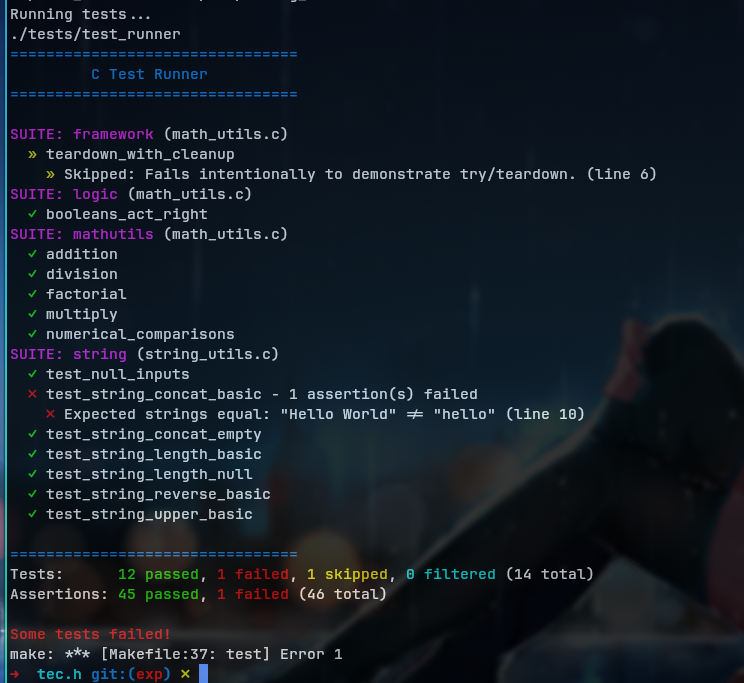

# TEC - Test C / Test Engine for C
TEC (Test C or Test Engine for C) is a lightweight, header-only testing library
designed to make C testing straightforward and efficient. It provides a clean
interface for writing and running unit tests with minimal setup.

> [!IMPORTANT]
> TEC is currently in the early stages of development, and while it is somewhat
> functional, it may still have some limitations and is subject to change.

## QUICK EXAMPLE
The only file you need from here is
[nob.h](https://github.com/ShashwatAgrawal20/tec.h/blob/main/tec.h). Just
copy-paste it to your project and start using it.
```c
// tec.c
#include "tec.h"

int add(int a, int b) { return a + b; }

void test_equal() {
    ASSERT_EQUAL(5, add(3, 2));
    ASSERT_NOT_EQUAL(3, add(1, 1));
    ASSERT_EQUAL(-2, add(-1, -1));
}

void test_strings() {
    ASSERT_STR_NOT_EQUAL("yoo", "Yoo");
    ASSERT_STR_EQUAL("yoo", "yoo");
}

void test_comparisions() {
    ASSERT_TRUE(add(3, 2) >= 5);
    ASSERT_FALSE(add(3, 2) != 5);
}

int main() {
    test_case_t tests[] =
        TEST_SUITE(TEST_FUNCTION(test_equal), TEST_FUNCTION(test_strings),
                   TEST_FUNCTION(test_comparisions));

    tec_test_run(tests);

    return 0;
}
```
```console
make
./tec
```

## EXAMPLE OUTPUT

